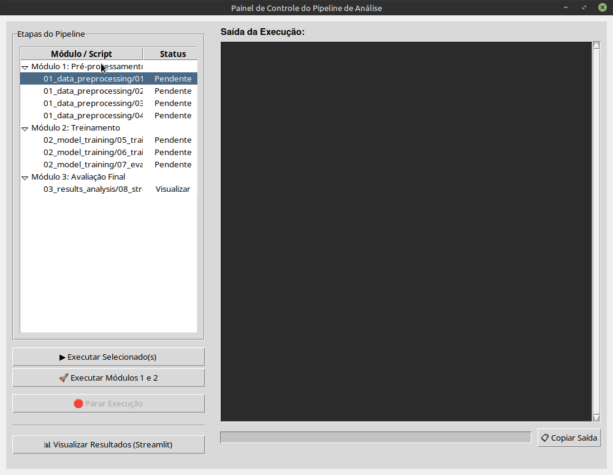
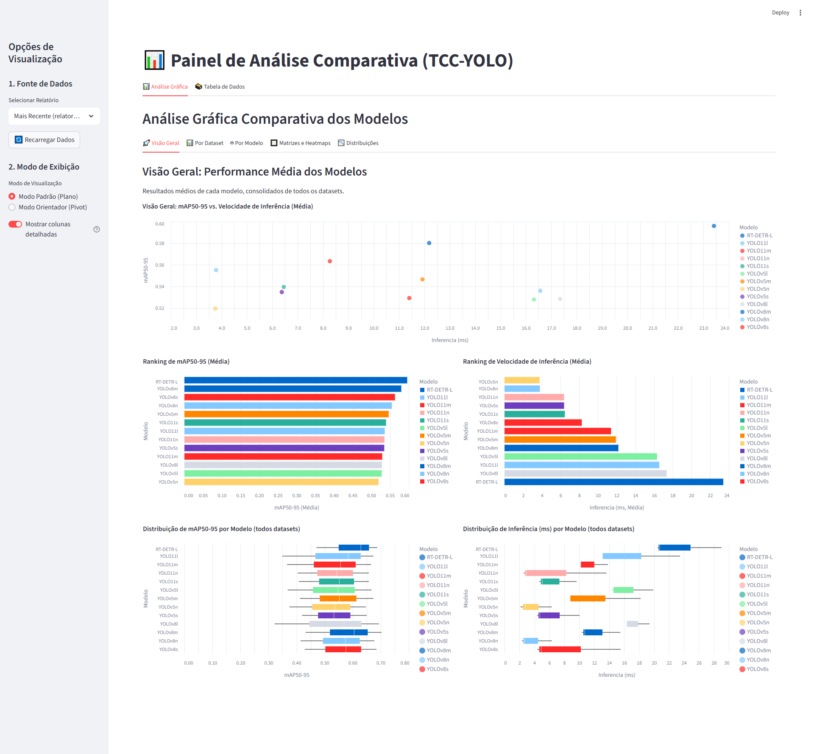
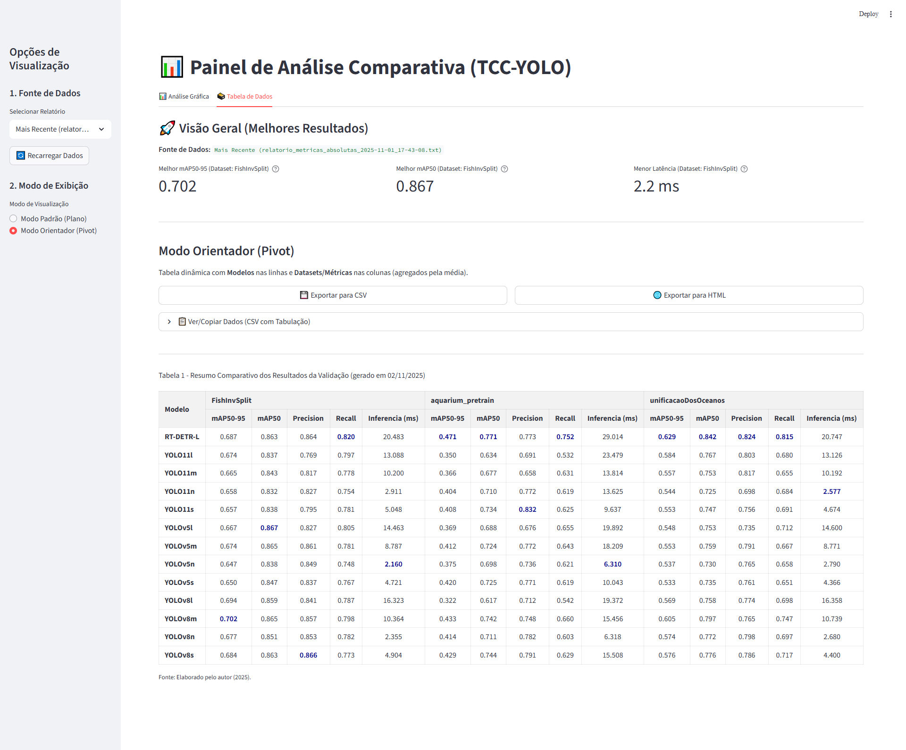
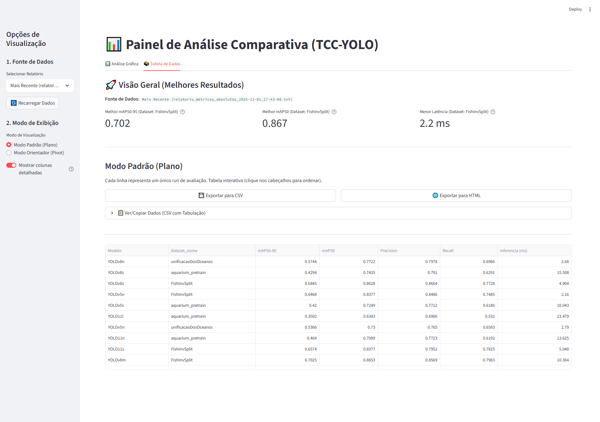
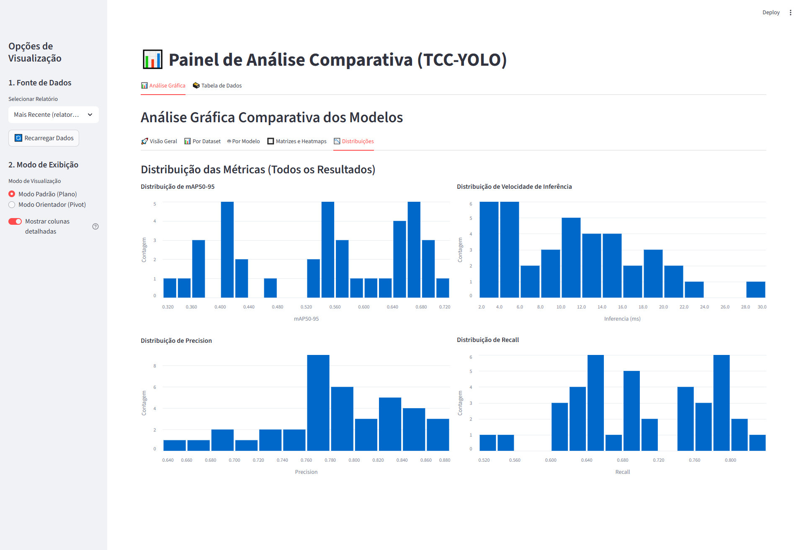
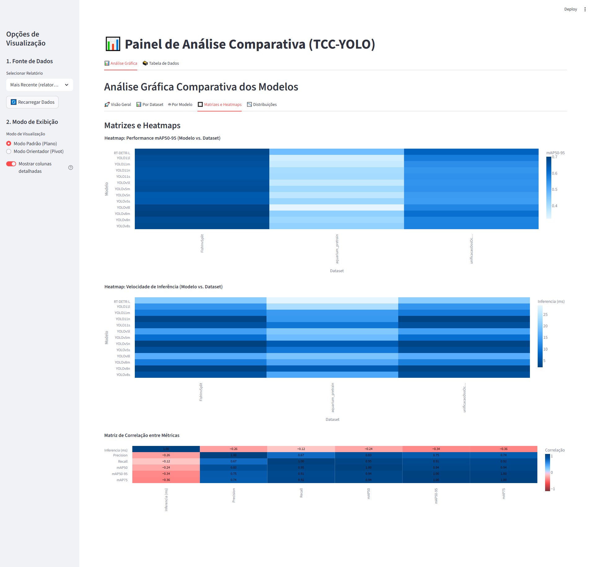
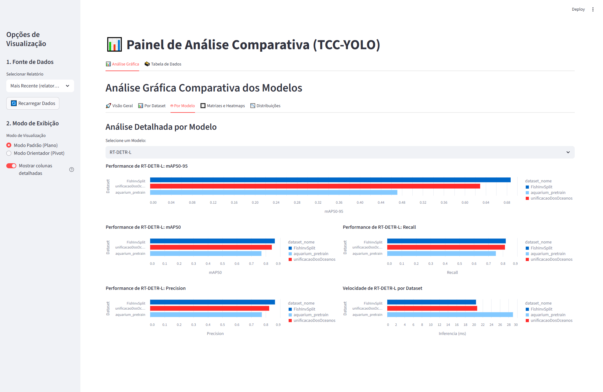

# Análise Comparativa de Modelos YOLO para Detecção de Vida Marinha


Pipeline automatizado, modular e reprodutível para o artigo "Análise Comparativa de Modelos YOLO para Detecção de Vida Marinha em Ambientes Subaquáticos".

## 🎥 Demonstração

**Painel de Controle (Tkinter)**


**Dashboard de Análise (Streamlit)**


## Tabela de Conteúdos

* [🎥 Demonstração](#-demonstração)
* [Visão Geral](#visão-geral)
* [✨ Principais Funcionalidades](#-principais-funcionalidades)
* [🛠️ Tecnologias Utilizadas](#️-tecnologias-utilizadas)
* [📁 Estrutura do Projeto](#-estrutura-do-projeto)
* [🚀 Como Utilizar](#-como-utilizar)
  * [1. Pré-requisitos](#1-pré-requisitos)
  * [2. Instalação](#2-instalação)
  * [🚀 3. Executando o Pipeline](#-3-executando-o-pipeline)
  * [📊 4. Visualizando os Resultados](#-4-visualizando-os-resultados)
* [5. Arquitetura](#5-arquitetura)
* [6. Screenshots](#6-screenshots)
* [7. 📄 Licença](#7--licença)


## Visão Geral

O objetivo deste pipeline é fornecer um fluxo de trabalho completo, desde a aquisição de dados até o treinamento e avaliação de diferentes modelos de detecção de objetos (YOLO e RT-DETR) para a tarefa de identificar vida marinha. A estrutura foi refatorada para máxima modularidade, manutenibilidade e clareza, alinhando-se diretamente com a metodologia da pesquisa.

## ✨ Principais Funcionalidades

* **Pipeline Modular:** Scripts independentes para cada etapa (Pré-processamento, Treinamento, Avaliação).
* **Configuração Centralizada:** Hiperparâmetros e caminhos são gerenciados de forma limpa nos arquivos em `config/`.
* **Orquestração Dupla:**
    * **GUI (Tkinter):** Um painel de controle (`gui/main_dashboard.py`) para execução visual e granular.
    * **CLI (Console):** Um menu interativo (`gui/run_pipeline_refactored.py`) para execução em servidores ou por linha de comando.
* **Dashboard de Resultados:** Um painel em Streamlit (`03_results_analysis/`) com mais de 20 gráficos interativos (Altair) para análise comparativa de performance, velocidade e precisão.
* **Reprodutibilidade:** O log centralizado (`utils/logger_config.py`) e a estrutura de pastas (`output/`) garantem que os resultados sejam rastreáveis e que os experimentos possam ser repetidos.

## 🛠️ Tecnologias Utilizadas

* **Python 3.8+**
* **Ultralytics:** Para os modelos YOLOv5, YOLOv8, e RT-DETR.
* **Streamlit:** Para o dashboard de análise de resultados.
* **Altair:** Para a geração de gráficos interativos.
* **Pandas:** Para manipulação e processamento dos dados dos relatórios.
* **Tkinter:** Para o painel de controle gráfico (GUI).

## 📁 Estrutura do Projeto

* **`config/`**: Contém arquivos de configuração centralizados para caminhos (`paths.py`) e hiperparâmetros de treinamento (`training_params.py`).
* **`utils/`**: Módulos de utilidade, como a configuração centralizada de logs (`logger_config.py`).
* **`01_data_preprocessing/`**: Scripts para o Módulo 1 (Integração e Pré-processamento de Dados).
* **`02_model_training/`**: Scripts para o Módulo 2 (Treinamento de Modelos e Avaliação).
* **`03_results_analysis/`**: Scripts e ferramentas para o Módulo 3 (Análise e Visualização de Resultados), incluindo o visualizador Streamlit.
* **`gui/`**: Contém o painel de controle principal da aplicação (`main_dashboard.py`) e o orquestrador de console (`run_pipeline_refactored.py`).
* **`data/`**: (Gerado automaticamente) Contém os datasets baixados e processados.
* **`output/`**: (Gerado automaticamente) Contém todos os artefatos gerados: logs, relatórios (`reports`), resultados de treinamento (`runs`) e artefatos de avaliação (`evaluations`).

## 🚀 Como Utilizar

### 1. Pré-requisitos
- Python 3.8+
- Git

### 2. Instalação

Clone o repositório e instale as dependências necessárias. É altamente recomendado usar um ambiente virtual.

```bash
# Clone o projeto
git clone https://github.com/p19091985/TCC-Analise-Comparativa-de-Modelos-YOLO-para-Deteccao-de-Vida-Marinha-em-Ambientes-Subaquaticos
cd TCC-Analise-Comparativa-de-Modelos-YOLO-para-Deteccao-de-Vida-Marinha-em-Ambientes-Subaquaticos

# Crie e ative um ambiente virtual (recomendado)
python -m venv venv
source venv/bin/activate  # No Linux/macOS
# venv\Scripts\activate   # No Windows

# Instale as dependências
pip install -r requirements.txt

### 🚀 3. Executando o Pipeline

Você tem duas opções principais para executar o pipeline. Ambas estão localizadas na pasta `gui/`.

---

#### 🖥️ Opção 1: Painel de Controle Gráfico (GUI) — **Recomendado**
Esta é a forma mais fácil de executar e monitorar o pipeline.

1. Certifique-se de que seu ambiente virtual (`venv`) esteja ativado.  
2. Execute o `main_dashboard.py` a partir da raiz do projeto:

```bash
python gui/main_dashboard.py
```

Use a interface gráfica para executar scripts individualmente ou todos os módulos em sequência.

---

#### ⚙️ Opção 2: Orquestrador via Console (CLI) — **Avançado**
Esta opção é ideal para execução em servidores ou para usuários que preferem o console.

1. Certifique-se de que seu ambiente virtual (`venv`) esteja ativado.  
2. Execute o `run_pipeline_refactored.py` para um menu interativo no console:

```bash
python gui/run_pipeline_refactored.py
```

Opcionalmente, você pode usar *flags* (modo legado) para pular etapas:

```bash
# Exemplo: Executa tudo, exceto o Módulo 1 (pré-processamento)
python gui/run_pipeline_refactored.py --skip-preprocessing

# Exemplo: Executa tudo, mas pula a etapa opcional de redução de dataset
python gui/run_pipeline_refactored.py --no-reduce
```

---

### 📊 4. Visualizando os Resultados
Após a execução do Módulo 2 (`07_evaluate_models_on_test_set.py`), os relatórios finais (`.txt`) são salvos em `output/reports/`.

Para visualizar o dashboard de resultados e os gráficos comparativos, execute o painel **Streamlit**:

```bash
streamlit run 03_results_analysis/08_streamlit_results_viewer.py
```

Alternativamente, você pode usar os botões **“📊 Visualizar Resultados”** no Painel de Controle (GUI) ou no menu do console (CLI) para lançar o dashboard automaticamente.


##  5. Arquitetura


## 6. Screenshots








---
## 7. 📄 Licença

Este projeto é distribuído sob a licença **MIT**. Veja o arquivo `LICENSE` para mais detalhes.